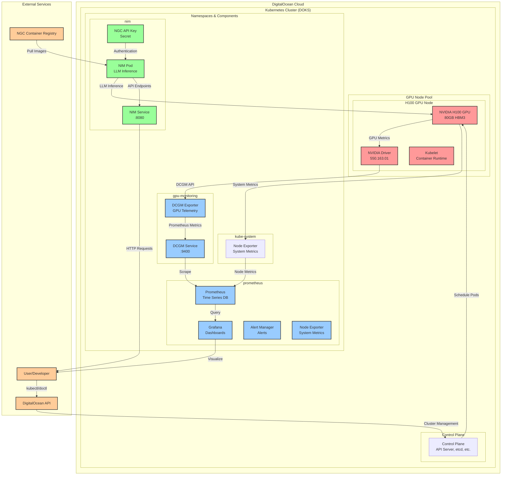
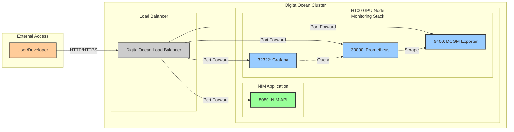

# Lab: Deploy NVIDIA NIM on DigitalOcean with GPU Support

This lab guides you through deploying NVIDIA NIM on DigitalOcean Kubernetes (DOKS) with GPU support and proper authentication setup.

**✅ Current Status**: This lab has been tested and validated with DigitalOcean H100 GPU clusters. The DCGM Exporter approach has been simplified to work reliably with DigitalOcean's GPU node configurations. Prometheus and Grafana monitoring stack is deployed and operational.

## Quick Start Summary

**Correct Order of Steps:**
1. **Prerequisites** - Install doctl, kubectl, Helm, get NGC API key
2. **Step 1** - Create H100 GPU cluster on DigitalOcean
3. **Step 2** - Install NVIDIA Device Plugin for basic GPU support
4. **Step 3** - Install DCGM Exporter (simplified approach for GPU monitoring)
5. **Step 3.5** - Handle GPU Node Taints (optional, for monitoring setup)
6. **Step 4** - Deploy NVIDIA NIM with proper authentication secrets
7. **Step 5** - Test NIM API functionality
8. **Step 6** - Cost optimization strategies
9. **Step 7** - Cleanup procedures

**Key Requirements:**
- Valid NGC API key in `.env` file as `NVIDIA_API_KEY`
- DCGM Exporter for GPU monitoring (simplified approach)
- Correct secret names: `NGC_API_KEY` (not `NGC_CLI_API_KEY`)
- DigitalOcean GPU nodes with `nvidia.com/gpu=1` label
- **Note**: GPU nodes have taints that may affect monitoring deployments

## Cluster Architecture Overview



### Architecture Components

**🏗️ Infrastructure Layer:**
- **DigitalOcean Kubernetes (DOKS)**: Managed Kubernetes cluster
- **H100 GPU Node Pool**: NVIDIA H100 80GB HBM3 GPUs
- **Control Plane**: Managed by DigitalOcean

**🔧 GPU Support Layer:**
- **NVIDIA Device Plugin**: Enables GPU resource scheduling
- **NVIDIA Driver**: 550.163.01 (pre-installed on GPU nodes)
- **DCGM Exporter**: GPU telemetry collection

**📊 Monitoring Stack:**
- **Prometheus**: Time-series metrics database
- **Grafana**: Visualization and dashboards
- **Alert Manager**: Alerting and notifications
- **Node Exporter**: System-level metrics

**🤖 Application Layer:**
- **NVIDIA NIM**: LLM inference engine
- **NGC Registry**: Container image source
- **API Services**: HTTP endpoints for inference

**🔐 Security Layer:**
- **NGC API Key**: Authentication for container registry
- **Kubernetes Secrets**: Secure credential storage
- **Network Policies**: Traffic control (optional)

### Data Flow

1. **Cluster Management**: User → DigitalOcean API → Kubernetes Control Plane
2. **GPU Monitoring**: H100 GPU → DCGM Exporter → Prometheus → Grafana
3. **Application Deployment**: NGC Registry → NIM Pod → GPU Resources
4. **Inference Requests**: User → NIM Service → GPU → Response
5. **System Monitoring**: Node → Node Exporter → Prometheus → Dashboards

### Network Connectivity & Ports



**Port Configuration:**
- **NIM API**: `8080` (internal), Load Balancer (external)
- **Prometheus**: `30090` (NodePort), `9090` (internal)
- **Grafana**: `32322` (NodePort), `3000` (internal)
- **DCGM Exporter**: `9400` (internal, scraped by Prometheus)

**Access Methods:**
- **Port Forwarding**: `kubectl port-forward` (development)
- **NodePort Services**: Direct cluster access (production)
- **Load Balancer**: External access (optional)

## Prerequisites

- DigitalOcean account with billing enabled
- doctl CLI tool installed and configured
- kubectl installed
- Helm installed
- NVIDIA API key for NIM container access

### Install and Configure doctl

```bash
# Install doctl (macOS with Homebrew)
brew install doctl

# Or download from GitHub releases
# https://github.com/digitalocean/doctl/releases

# Authenticate with your DigitalOcean API token
doctl auth init

# You'll be prompted to enter your API token
# Get your API token from: https://cloud.digitalocean.com/account/api/tokens
# Make sure to select "Full Access" scope

# Verify authentication
doctl account get
```

### Configure Environment Variables

This lab uses a `.env` file to manage configuration variables. A template `.env.example` file is provided.

```bash
# Copy the example file to create your .env file
cp .env.example .env

# Edit the .env file with your configuration
vi .env
```

**Important**: Make sure to update the `NVIDIA_API_KEY` in the `.env` file with your actual NVIDIA API key before proceeding.


## Step 1: Create DigitalOcean H100 Cluster

```bash
# Load environment variables from .env file
source .env

# Create the cluster with H100 GPU node pool
doctl kubernetes cluster create ${CLUSTER_NAME} \
  --region ${REGION} \
  --version latest \
  --node-pool "name=${NODE_POOL_NAME};size=${GPU_NODE_SIZE};count=${NODE_POOL_COUNT}"

# Expected output and timing:
# Notice: Cluster is provisioning, waiting for cluster to be running
# .......................................................................................
# Notice: Cluster created, fetching credentials
# Notice: Adding cluster credentials to kubeconfig file found in "/Users/ravs/.kube/config"
# Notice: Setting current-context to do-tor1-nim-h100-cluster
# ID                                      Name                Region    Version        Auto Upgrade    Status     Node Pools
# 31e8a775-a347-4f17-aca6-871606d7bb25    nim-h100-cluster    tor1      1.33.1-do.3    false           running    h100-worker-pool
# doctl kubernetes cluster create ${CLUSTER_NAME} --region ${REGION} --version   0.19s user 0.08s system 0% cpu 7:49.82 total
#
# Note: Cluster creation typically takes 7-10 minutes for H100 GPU nodes

# Download cluster credentials
doctl kubernetes cluster kubeconfig save ${CLUSTER_NAME}

# Verify cluster connection
kubectl get nodes
```

## Step 2: Install NVIDIA Device Plugin

```bash
# Install NVIDIA device plugin
kubectl apply -f https://raw.githubusercontent.com/NVIDIA/k8s-device-plugin/v0.15.0/deployments/static/nvidia-device-plugin.yml

# Verify device plugin is running
kubectl get pods -n kube-system | grep nvidia

# Wait for GPU to become available (may take 30-60 seconds)
sleep 30

# Verify GPU is now available
kubectl get nodes -o json | jq '.items[0].status.allocatable | select(."nvidia.com/gpu")'
```

## Step 3: Install DCGM Exporter (Simplified Approach)

**Important**: DigitalOcean GPU nodes have specific configurations that make the full GPU Operator complex to deploy. We'll use a simplified approach with just DCGM Exporter, following DigitalOcean's recommended practices.

# Create namespace
kubectl create namespace gpu-monitoring

# Apply the DCGM Exporter deployment
kubectl apply -f dcgm-exporter-deployment.yaml

# Wait for DCGM Exporter to be ready
kubectl wait --for=condition=ready pod -l app=dcgm-exporter -n gpu-monitoring --timeout=300s

# Verify DCGM Exporter is running
kubectl get pods -n gpu-monitoring

# Test DCGM Exporter metrics
kubectl port-forward service/dcgm-exporter 9400:9400 -n gpu-monitoring &
curl localhost:9400/metrics | head -10

# Verify DCGM Exporter is working correctly
kubectl logs -n gpu-monitoring -l app=dcgm-exporter | grep "Starting webserver"

## Step 3.5: Handle GPU Node Taints (Optional - For Monitoring)

**⚠️ IMPORTANT**: DigitalOcean H100 GPU nodes have a taint `nvidia.com/gpu:NoSchedule` that prevents non-GPU workloads from being scheduled. This affects monitoring tools like Prometheus.

**If you plan to deploy Prometheus monitoring**, you need to address this taint:

```bash
# Check current node taints
kubectl describe node | grep -A 5 Taints

# Option A: Remove GPU taint (Recommended for single-node clusters)
kubectl taint nodes --all nvidia.com/gpu:NoSchedule-

# Option B: Add tolerations to monitoring workloads (for multi-node clusters)
# This is handled in the Prometheus setup documentation
```

**For comprehensive monitoring setup and configuration**, see [docs/monitoring-guide.md](docs/monitoring-guide.md). This guide covers:
- Complete Prometheus and Grafana setup
- GPU metrics configuration
- Dashboard creation and import
- Troubleshooting and best practices

**For individual component guides:**
- [Prometheus Setup](docs/prometheus-setup.md)
- [Grafana Configuration](docs/grafana-setup.md)

## Step 4: Deploy NVIDIA NIM (Optimized for H100)

Deploy NVIDIA NIM using the official NGC Helm chart. We'll use Llama 3.1 8B which is a good starting point for testing.

**⚠️ IMPORTANT: Before proceeding, make sure you have:**
1. **Valid NVIDIA NGC API Key**: Update the `NVIDIA_API_KEY` in your `.env` file with your actual NGC API key
2. **NGC Account**: You need an NVIDIA NGC account with access to NIM models
3. **API Key Permissions**: Your API key must have access to `nvcr.io/nim/meta/` repositories

**To get your NGC API key:**
1. Go to [NVIDIA NGC](https://ngc.nvidia.com/)
2. Sign in to your account
3. Go to "API Keys" in your profile
4. Create a new API key or copy an existing one
5. Update your `.env` file: `NVIDIA_API_KEY=your-actual-api-key-here`

**Without a valid API key, the NIM deployment will fail with 401 Unauthorized errors.**

```bash
# Load environment variables from .env file
source .env

# Create namespace for NIM
kubectl create namespace ${NIM_NAMESPACE}

# Fetch NIM LLM Helm Chart
helm fetch https://helm.ngc.nvidia.com/nim/charts/nim-llm-1.3.0.tgz \
  --username='$oauthtoken' \
  --password=$NVIDIA_API_KEY

# Configure Docker registry secret for nvcr.io
kubectl create secret docker-registry registry-secret \
  --docker-server=nvcr.io \
  --docker-username='$oauthtoken' \
  --docker-password=$NVIDIA_API_KEY \
  -n ${NIM_NAMESPACE}

# Configure NGC API secret (note: pod expects NGC_API_KEY, not NGC_CLI_API_KEY)
kubectl create secret generic ngc-api \
  --from-literal=NGC_API_KEY=$NVIDIA_API_KEY \
  -n ${NIM_NAMESPACE}

# Launch NIM deployment
helm install my-nim nim-llm-1.3.0.tgz \
  -f nim_custom_value.yaml \
  --namespace ${NIM_NAMESPACE}

# Verify NIM pod is running
kubectl get pods -n ${NIM_NAMESPACE}

# Monitor pod startup (H100 models take longer to load)
kubectl logs -f my-nim-nim-llm-0 -n ${NIM_NAMESPACE}
```

## Step 5: Test NIM API

```bash
# Load environment variables from .env file
source .env

# Enable port forwarding to access NIM service locally
kubectl port-forward service/my-nim-nim-llm 8000:8000 -n ${NIM_NAMESPACE} &

# Wait a moment for port forwarding to establish
sleep 5

# Test NIM API
curl -X 'POST' \
  'http://localhost:8000/v1/chat/completions' \
  -H 'accept: application/json' \
  -H 'Content-Type: application/json' \
  -d '{
    "messages": [
      {
        "content": "Hello, how are you?",
        "role": "user"
      }
    ],
    "model": "meta/llama3-8b-instruct",
    "max_tokens": 50,
    "temperature": 0.7
  }'
```

## Step 6: Cost Optimization

Since your H100 cluster costs $3.39/hour (~$2,500/month if running 24/7):

```bash
# Scale down when not in use
kubectl scale statefulset my-nim-nim-llm --replicas=0 -n ${NIM_NAMESPACE}

# Scale back up when needed
kubectl scale statefulset my-nim-nim-llm --replicas=1 -n ${NIM_NAMESPACE}

# Check resource usage
kubectl top nodes
kubectl top pods -n nim
```

## Step 7: Cleanup

**Important**: Your H100 cluster costs $3.39/hour. To avoid unexpected charges:

```bash
# Scale down (recommended for temporary pause)
kubectl scale statefulset my-nim-nim-llm --replicas=0 -n ${NIM_NAMESPACE}

# Delete cluster (WARNING: deletes all data)
doctl kubernetes cluster delete ${CLUSTER_NAME}
```